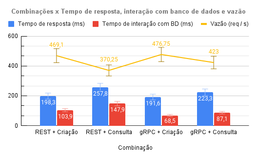

# Microservices Communication Analysis Apps

Monorepo written in Golang for performance analysis on 3 methods for microservices communication. The methods and packages used are:

- REST using [Fiber](https://github.com/gofiber/fiber)
- [gRPC](https://grpc.io/docs/languages/go/quickstart/)
- [RabbitMQ](https://github.com/rabbitmq/amqp091-go) (*message queue*)


   

## :scroll: Full paper

[Microservices communication methods (REST, gRPC, Message Broker) performance analysis (pt-BR)](https://drive.google.com/file/d/1wosRutXvNHIUwBepBZVAmtmMULP-NjBj/view?usp=sharing)

## :dart: Main goals

:white_check_mark: Implement all three methods of communication in a *Monorepository* and use clean architecture.
:white_check_mark: Which communication method perform better considering the defined parameters.
:white_check_mark: Which communication method presents the least failures in the stress test.
:white_check_mark: What's the main bottleneck in the system.

## :clipboard: Main parameters and metrics

:warning: The message queue method was removed from the final analysis due to the used methodology and some unexpected discoveries. Other parameters were removed too, like de report generation feature. For more details, check the [Full Paper](#scroll-full-paper).

### Parameters

|Name|Variations|
|---|---|
|Communication method|REST and gRPC|
|Server feature|REST and gRPC|
|Simultaneous users|100 and 200|
|Request quantity| 10.000|

### Metrics

|Metric name|Unit of measurement|
|---|---|
|Average response time|milliseconds|
|Failures|percentage|
|Average memory usage|KB|
|Average database interaction time|milliseconds|
|Throughput|requests per second|

## :chart_with_upwards_trend: Main results (pt-BR)

Testing the combination of all the parameters and it's variations and getting their results for the given metrics.

### Memory usage:

:bulb: The gRPC method consumes more memory.

100 and 200 users:

 

### Failures:

:bulb: At 200 users, the REST method gets more failures:


### Time metrics:

:bulb: The gRPC is faster than REST in retrieving data cases.
:bulb: The REST is faster in other cases.
:bulb: The REST database interaction time is bigger than in gRPC, which means that REST server consumes more from database.

100 and 200 users:

 

### Main bottleneck

The main bottleneck was the PostgreSQL database simultaneous connection threshold. All the failures above :point_up: was this particular case. 

**It seems that the main problem is not the communication method at all.**

## :gem: Proposed architecture


## :open_file_folder: Project structure

### `cmd`

Contains the project applications. For more details check the [README](./cmd/README.md).

### `internal`

Contains all project internal files that can be used in all applications.

- `apps`: all the client/server applications definitions such as endpoints, methods and message consumers. For more details check the [README](./internal/apps/README.md).
- `repository.go`: the database repository functions.
- `domain.go`: definition on domain entities.
- `usecases` the project use cases. For more details check the [README](./internal/usecases/README.md).

### `docker-compose.yml`

Defines the containers for applications and dependencies such as PostgreSQL and RabbitMQ.

:key: The applications are set with limited CPU cores and memory, if you want to change it, you must do it at services definitions on this file.

### `locustfile.py`

Contains the definition of stress tests using [Locust](https://locust.io/).

### `Makefile`

Contains all the commands for running and managing dependencies.

## :running: Running the project

### Database

Run the following query for `products` table:

```sql
CREATE TABLE IF NOT EXISTS
  products (
    id UUID NOT NULL,
    name TEXT NOT NULL,
    sku VARCHAR(64) NOT NULL,
    seller_name VARCHAR(64) NOT NULL,
    price FLOAT NOT NULL,
    available_discount FLOAT NOT NULL,
    available_quantity INTEGER NOT NULL,
    sales_quantity INTEGER NOT NULL,
    active BOOLEAN NOT NULL,
    created_at TIMESTAMPTZ NOT NULL default now(),
    updated_at TIMESTAMPTZ NOT NULL default now(),
    CONSTRAINT product_pkey PRIMARY KEY (id)
);
```

### Starting applications

Using Docker, you can just run `make start` to start all services and build/run the applications.

### BFF endpoints and parameters

|Endpoint|Parameters|
|---|---|
|`/interact/http`|resource: create/report/getByDiscount, request_quantity: int|
|`/interact/grpc`|resource: create/report/getByDiscount, request_quantity: int|
|`/interact/rabbitmq`|resource: create/report/getByDiscount, request_quantity: int|

### Stress testing

Just run `make load-testing` to start Locust. The test and GUI will be at `http://0.0.0.0:3002`.

The file example is testing `gRPC` with `getByDiscount` feature, to test all the applications and `create` at the same time:

```python
def do_client_http_server_interaction(self):
  headers = {
      "Content-Type": "application/json"
  }

  payload = {
      "resource": "create",
      "request_quantity": 1
  }

  res = self.client.post("/interact/http", json=payload, headers=headers)

def do_client_grpc_server_interaction(self):
  headers = {
      "Content-Type": "application/json"
  }

  payload = {
      "resource": "create",
      "request_quantity": 1
  }

  res = self.client.post("/interact/grpc", json=payload, headers=headers)

def do_client_rabbitmq_server_interaction(self):
  headers = {
      "Content-Type": "application/json"
  }

  payload = {
      "resource": "create",
      "request_quantity": 1
  }

  res = self.client.post("/interact/rabbitmq", json=payload, headers=headers)
```

You can set the `locustfile.py` at the best approach to improve your tests.

---
Made with :rage: and :heart: by RafaelEmery for my undergraduate thesis
